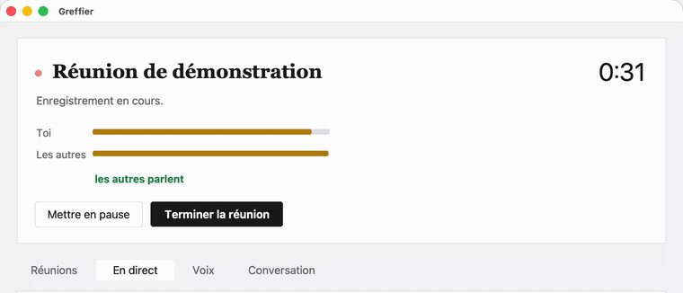

# Greffier

Enregistre une réunion, identifie qui parle, en rédige le compte rendu.
**Rien ne sort du poste** — la transcription et la reconnaissance des voix
tournent en local, sur le processeur graphique du Mac.

> Le greffier assiste à la séance, note qui a dit quoi, et produit le compte rendu.


## Ce que ça fait

```
audio de réunion → transcription → qui parle → noms → compte rendu → mail
```

- **Enregistrement** en deux canaux séparés (ton micro à gauche, les autres à
  droite) : en visio, distinguer ta voix de celle des autres est une certitude
  matérielle, pas une déduction.
- **Transcription** par whisper.cpp accéléré Metal, modèle `large-v3-turbo`.
- **Identification des voix** par empreinte vocale (pyannote + TitaNet), en local.
- **Attribution des noms** : les participants se nomment entre eux pendant la
  réunion, l'outil relève ces indices et les recoupe. Personne n'a besoin de se
  présenter. Ce qui reste incertain est proposé, jamais affirmé.
- **Transcription en direct, corrigeable** : ce qui se dit s'affiche dans la
  fenêtre pendant la réunion, avec qui parle. Un clic sur un nom le corrige — et
  cette correction vaut pour tous les passages de cette voix, entre en banque, et
  s'impose au compte rendu final. Une attribution fausse se rattrapait jusqu'ici
  en relisant le compte rendu, une heure trop tard.
- **Banque de voix** : une fois qu'une voix porte un nom, la personne est
  reconnue aux réunions suivantes.
- **Compte rendu** horodaté, avec le temps de parole et les décisions.

## Installation

Une seule commande, sur les trois systèmes :

```sh
git clone https://github.com/tanguychenier/greffier.git
cd greffier
python3 outils/installer.py          # Windows : python outils\installer.py
```

L'installeur **détecte ce qui manque et l'installe**, plutôt que d'afficher une
liste de commandes à recopier. Il demande confirmation avant chaque installation,
il est **relançable sans risque**, et il reprend les modèles déjà présents sur le
poste au lieu de les retélécharger.

Sur macOS, il fabrique aussi **`/Applications/Greffier.app`**, une application
autonome : interpréteur, bibliothèques et code sont copiés dedans, rien ne
pointe vers le dépôt ni vers un dossier caché du compte. Elle est signée avec
une identité **stable** — un certificat Apple déjà dans le trousseau s'il y en a
un, sinon un certificat local créé une fois pour toutes, macOS demandant alors
le mot de passe de session une seule fois — de sorte que les autorisations
accordées survivent aux réinstallations. Une modification du code ne s'y voit
qu'en relançant l'installeur ; la ligne de commande du dépôt, elle, suit le code.

Il enchaîne ensuite sur l'**assistant de configuration**, qui pose les questions
qu'il faut et écrit un `.env` valide :

- ce que la machine sait faire — mémoire, calcul, micro, capture du son système —
  et **quel modèle elle fait tourner sans souffrir** ;
- qui rédige : l'assistant en ligne de commande est-il installé, et **la session est-elle ouverte** ?
  Sans cela, l'échec n'apparaîtrait qu'après une heure de transcription ;
- où arrive le compte rendu : par courriel — Outlook déjà authentifié, sinon SMTP,
  le mot de passe restant hors du fichier — ou simplement dans un dossier ;
- le vocabulaire de tes réunions, qui sert aussi de liste de mots à ne jamais
  prendre pour des prénoms.

```sh
greffier configurer      # relançable quand la machine ou l'adresse changent
greffier diagnostic      # constater sans rien modifier
```

```
python3 outils/installer.py --verifier   # constate sans rien installer
python3 outils/installer.py --oui        # sans poser de question
```

Il n'utilise que la bibliothèque standard de Python : il doit tourner *avant*
que quoi que ce soit ne soit installé, donc il ne peut dépendre de rien.
Python 3.9 suffit à le lancer.

### Ce qu'il fait, et ce qui diffère selon le système

| | macOS | Linux | Windows |
|---|---|---|---|
| Transcription | whisper.cpp, accéléré Metal | faster-whisper | faster-whisper |
| Empreintes vocales | sherpa-onnx | sherpa-onnx | sherpa-onnx |
| Capter le son des autres | BlackHole (pilote à installer) | moniteur PipeWire/PulseAudio, **rien à installer** | boucle WASAPI, intégrée |
| Rédaction du compte rendu | Ollama (local) ou un assistant en ligne de commande | idem | idem |
| Envoi du compte rendu | Outlook déjà authentifié | à porter (SMTP) | à porter |
| Interface | **la même fenêtre** (Tkinter) | idem | idem |

Le cœur — transcription, identification des voix, attribution des noms, compte
rendu — tourne à l'identique partout. Ce qui diffère est **la capture du son
système** et **l'interface**, précisément les deux endroits que l'architecture
isole derrière des ports.

Sur macOS, deux périphériques audio doivent être créés une fois : `Reunion
Entree` (agrégé : micro + BlackHole) et `Reunion Sortie` (multiple : casque +
BlackHole). Sur Linux et Windows, rien de tel — le système expose déjà de quoi
réenregistrer sa propre sortie.

> Un périphérique agrégé macOS référence un **matériel précis**. Casque
> débranché = micro absent de l'agrégé = enregistrement muet. Il faut le
> reconstruire quand le matériel change.

### Les modèles

Téléchargés une fois, plus aucun appel réseau ensuite.

| Modèle | Rôle | Taille | Quand |
|---|---|---|---|
| `ggml-large-v3-turbo` | transcription | 1,5 Go | macOS seulement |
| `ggml-small` | transcription en direct | 0,5 Go | macOS, facultatif |
| `ggml-silero-v5.1.2` | détection de la parole | 0,9 Mo | macOS seulement |
| `faster-whisper large-v3` | transcription | 1,5 Go | Linux et Windows |
| `nemo_en_titanet_large` | empreintes vocales | 98 Mo | partout |
| `pyannote-segmentation-3.0` | découpage en tours de parole | 6 Mo | partout |

### Rédaction du compte rendu

**Un assistant en ligne de commande par défaut.** Distinguer une décision d'une hypothèse, rattacher
une position à une personne, signaler ce que la transcription a perdu plutôt que
de le combler : c'est hors de portée des modèles qui tournent sur un portable.
C'est le **seul maillon de la chaîne qui sort du poste** — la transcription part
vers une API distante — et c'est un choix assumé.

Pour ne rien laisser sortir du tout, **Ollama** le remplace sans rien changer
d'autre, au prix d'une synthèse plus grossière :

```sh
GREFFIER_COMPTE_RENDU__MOTEUR=ollama greffier traiter reunion.wav
```

L'assistant rédige avec le **second modèle de la gamme**, pas le premier. C'est
un choix, pas un défaut subi : rédiger à partir d'une transcription déjà
découpée et attribuée est un travail de synthèse, pas de raisonnement long. Le
haut de la gamme rend le même document en entamant un quota bien plus vite —
une réunion par jour suffit à le sentir. Le modèle est demandé **explicitement**
à l'appel, pour que le compte rendu ne change pas de rédacteur au gré du
réglage personnel du poste. Il se change dans l'onglet Réglages, ou par
`GREFFIER_COMPTE_RENDU__MODELE`.

Sans l'un ni l'autre, la transcription et l'identification des voix fonctionnent
quand même ; seul le compte rendu manque.

### Configuration

Par variables d'environnement, un fichier `.env`, ou un `config.toml`. Dans cet
ordre de priorité : on doit pouvoir forcer un réglage le temps d'une commande
sans modifier de fichier.

```sh
cp .env.exemple .env        # à la racine, ou dans le dossier de configuration
```

| Système | Configuration et données |
|---|---|
| macOS | `~/Library/Application Support/Greffier` — l'emplacement natif, pas un dossier caché : les gardes du poste contestaient chaque accès à `~/.config` et `~/.local`, jusqu'à refuser une écriture en pleine réunion |
| Linux | `~/.config/greffier` et `~/.local/share/greffier` |
| Windows | `%APPDATA%\greffier` et `%LOCALAPPDATA%\greffier` |

`XDG_CONFIG_HOME` et `XDG_DATA_HOME`, s'ils sont posés, l'emportent partout. Un
poste installé avant ce changement est déménagé par l'installeur, sans rien perdre.

Le plus courant se règle **dans la fenêtre**, onglet Réglages : micro, compte
du rédacteur, modèle de transcription et langue, rédacteur et son modèle,
destinataire, transcription en direct, apparence claire ou sombre. **Aucun
bouton à valider** : chaque changement s'applique et s'écrit dans `config.toml`
aussitôt, la version précédente restant en `config.toml.precedent`. Le thème
repeint la fenêtre sur le champ, sans relancer.

Un bloc dit ce qui rédige : version installée, adresse et organisation du compte
connecté, formule. Trois actions à côté — se connecter, qui ouvre un terminal là
où la connexion se fait vraiment ; mettre à jour ; actualiser. Sans session, tout
fonctionne sauf le compte rendu, et l'échec n'apparaîtrait qu'après la
transcription. Le vocabulaire métier et les mots
qui ne sont jamais des prénoms restent au fichier : ce sont des listes, qu'un
formulaire tronquerait.

| Variable | Rôle |
|---|---|
| `GREFFIER_COMPTE_RENDU__MOTEUR` | `claude`, `ollama` ou `aucun` |
| `GREFFIER_COMPTE_RENDU__MODELE` | le modèle du rédacteur — le second de la gamme par défaut |
| `GREFFIER_COMPTE_RENDU__DESTINATAIRE` | à qui envoyer le compte rendu |
| `GREFFIER_TRANSCRIPTION__LANGUE` | code à deux lettres ; **vide, le modèle la reconnaît lui-même** |
| `GREFFIER_TRANSCRIPTION__VOCABULAIRE` | noms propres du contexte — le réglage qui améliore le plus la transcription des termes rares |
| `GREFFIER_LOCUTEURS__PAS_DES_PRENOMS` | mots à ne jamais prendre pour des prénoms |
| `GREFFIER_DIRECT__ACTIF` | `false` coupe la transcription en direct, et son coût en calcul |
| `GREFFIER_DIRECT__PERIODE` | secondes entre deux tranches transcrites (10 par défaut) |
| `GREFFIER_APPARENCE__THEME` | `systeme`, `clair` ou `sombre` |

Le double tiret bas sépare la section du champ. Rien de tout cela ne vit dans le
dépôt : adresse mail, vocabulaire métier et noms de projets sont propres à chacun.

### Autorisations macOS

Demandées **une fois**, à la première utilisation, comme pour toute application.
La signature du paquet étant stable, ni une mise à jour ni une réinstallation ne
les redemandent.

- **Micro** — sans elle, l'enregistrement est muet.
- **Automatisation ▸ Microsoft Outlook** — seulement pour l'envoi par mail. La
  boîte de dialogue système n'apparaît pas toujours, le traitement tournant
  détaché : `Réglages Système ▸ Confidentialité et sécurité ▸ Automatisation`.

## Est-ce que ça marche vraiment ?

Ce ne sont pas des affirmations : chaque ligne ci-dessous a été exécutée.

**Installation en salle blanche, macOS** — clone neuf depuis GitLab, aucun modèle
présent, reprise désactivée. Les 1,5 Go ont bien été téléchargés (aucun lien
symbolique dans le dossier de modèles), 44 tests passés, modèle d'empreintes
chargé.

**Installation sur Linux, image nue** — reproductible par toi :

```sh
mkdir contexte && cp -r . contexte/greffier
docker build -f outils/preuve-linux.Dockerfile -t greffier-preuve contexte
```

Depuis une `python:3.13-slim` sans rien d'autre que git, l'installeur pose
ffmpeg par apt, bascule sur faster-whisper faute de whisper.cpp, télécharge les
modèles, se rabat sur `venv + pip` faute de `uv`, prépare le modèle de
transcription, écrit la configuration — puis les 44 tests passent et une
empreinte vocale de 192 dimensions est réellement extraite sous Linux.

**Le fil en direct, rejoué en temps réel** — une visio synthétique à trois
canaux est réécrite par ffmpeg à la vitesse du son, ce qui reproduit exactement
la capture, en-tête à taille indéterminée compris. La vraie commande tourne
dessus. Résultat : la personne au micro affichée « Toi » par le canal, les trois
prises de parole distantes regroupées en une seule voix, une correction saisie en
cours de réunion propagée aux phrases suivantes **et versée en banque de voix**,
d'où le compte rendu final la reprend.

Coût mesuré d'une tranche de dix secondes, bout en bout, sur un Mac Apple
Silicon : **1,50 s** — découpe 0,04, mise à niveau des canaux 0,53,
transcription 0,89, empreinte 0,04. Avec le *grand* modèle, faute du petit :
la période de dix secondes tient avec six fois la marge nécessaire.

**Chaîne réelle, de bout en bout** — un test d'intégration **synthétise une
fausse réunion à deux voix** (une vraie réunion contient des échanges de travail
et des voix identifiables, elle ne peut pas servir de jeu d'essai), la passe dans
whisper et la diarisation, et vérifie que les deux prénoms — prononcés en
auto-présentation, en interpellation et en remerciement — sont retrouvés :

```sh
pytest -m integration
```

C'est lui qui a trouvé un défaut invisible aux tests unitaires : whisper fait
commencer sa première réplique à `00:00,00` alors que la segmentation ne détecte
la parole qu'à `00:00,30`, si bien qu'une auto-présentation tombait entre deux
tours de parole et ne désignait personne.

**À chaque poussée** — `.gitlab-ci.yml` rejoue les tests du domaine. L'installation
Linux complète tourne sur planification, étant plus coûteuse.

## Utilisation

```sh
greffier enregistrer "point recette"   # démarre
greffier statut                        # où en est-on
greffier arreter                       # arrête, transcrit, identifie, rédige

greffier reunions                      # ce qui a déjà été traité
greffier voix                          # les voix de la dernière réunion
greffier voix --ecouter 3              # en extraire dix secondes
greffier voix --nommer 3 --nom Josiane # la nommer : reconnue les fois suivantes
greffier connus                        # les voix déjà en banque

greffier assister                      # affiche ce qui se dit, relève les propositions
greffier propositions                  # liens, instructions et décisions relevés

greffier montage                       # les passages marquants, vraies voix
greffier lire                          # le compte rendu lu à voix haute
greffier tickets                       # les actions décidées, prêtes à ouvrir
greffier archiver                      # compresse les enregistrements traités
```

### La fenêtre


```sh
greffier fenetre        # ou double-clic sur Greffier dans le Launchpad
```

Tout s'y fait sans terminal, et **la même sur les trois systèmes** : Tkinter vient
avec Python, il n'y a rien à installer.



- **Démarrer, mettre en pause, terminer.** La pause sert : une interruption ne
  doit pas obliger à clore la séance, sinon le traitement part et il faut
  recommencer une seconde réunion, avec deux comptes rendus à la fin.
- **Vumètres `Toi` / `Les autres`**, pour vérifier que le micro capte *avant* la
  réunion et non une heure trop tard, et qui parle en ce moment. La provenance
  suffit à le dire : le micro d'un côté, la boucle système de l'autre.
- **Onglet `En direct`** : ce qui se dit, au fil de l'eau, avec qui parle.
  L'onglet s'ouvre de lui-même quand la réunion démarre.
  - `Toi` vient du **canal** : le micro désigne la personne qui enregistre, sans
    consulter le moindre modèle, et sans jamais se tromper.
  - Un nom suivi d'un **`?`** vient de l'empreinte vocale : c'est une
    proposition, pas une affirmation.
  - **Un clic sur le nom le corrige.** Par défaut la correction porte sur toute
    la voix — quand l'outil se trompe de personne, il se trompe pour tous ses
    passages ; « Seulement cette phrase » sert aux chevauchements. La correction
    s'affiche aussitôt, s'applique aux phrases suivantes, entre en banque de
    voix, et c'est ainsi que le compte rendu final retrouve la personne seul.
- **Le poste se règle seul** : micro réellement branché, sortie système basculée
  vers la boucle de capture, gain relevé s'il est trop bas. Ces trois réglages
  ont dû être faits à la main lors d'une réunion réelle, et leur absence a coûté
  la voix de la personne qui enregistrait.
- **Nommer les voix**, en écoutant dix secondes. Une voix nommée entre en banque
  et se reconnaît seule ensuite.
- **Poser une question** sur un compte rendu, et l'envoyer par courriel.

Il n'y a **pas de sujet à saisir** : le compte rendu donne son titre à la
réunion, écrit après l'avoir écoutée. Demander à l'avance supposerait de savoir
de quoi une réunion va parler.

## Architecture

Hexagonale — le métier au centre, les techniques autour.

```
src/greffier/
├── domaine/       cœur métier, aucune dépendance : modèles, règles d'attribution
│                  des noms, rapprochement des empreintes. Testable sans audio.
├── ports/         interfaces attendues par le domaine (Protocol)
├── application/   cas d'usage : orchestration des ports
├── adaptateurs/   ffmpeg, whisper.cpp, sherpa-onnx, rédacteur IA, Outlook, CoreAudio
├── interface/     la fenêtre (Tkinter) : palette, formes dessinées, écrans
└── cli.py         interface en ligne de commande (Typer)
macos/             création des périphériques audio (Swift) et le paquet .app
```

Le domaine ne connaît ni whisper, ni ffmpeg, ni Outlook. C'est ce qui permet de
tester les règles d'attribution des noms sur des phrases écrites à la main, en
quelques millisecondes, sans modèle de 1,6 Go.

## Distribuer

```sh
uv build --wheel                     # produit dist/greffier-0.1.0-py3-none-any.whl
pipx install dist/greffier-*.whl     # ou pip install, dans un environnement dédié
```

La roue ne contient que le code : les modèles se récupèrent à la première
exécution de `outils/installer.py`.

## Développement

L'installeur fait déjà tout le nécessaire. Pour recalibrer les seuils de
reconnaissance des voix sur un enregistrement à toi :

```sh
.venv/bin/python outils/calibrer_seuils.py <enregistrement.wav>
.venv/bin/python outils/verifier_fusion.py <enregistrement.wav>
```

La méthode et les mesures en vigueur sont dans [`docs/calibrage.md`](docs/calibrage.md).

Pose les crochets git une fois pour toutes :

```sh
./outils/crochets/installer.sh
```

Un commit qui ne passe pas `ruff`, `mypy` et les tests est alors **refusé**.
Lancer les contrôles « à côté » ne suffit pas — trois remarques de qualité sont
passées dans des commits avant que ce garde-fou n'existe. `--no-verify` reste
possible, en connaissance de cause.

L'intégration continue rejoue les trois et **échoue** sur la moindre remarque.

## État

Le portage depuis la chaîne de scripts d'origine (`~/reunions/`, abandonnée
le 2026-08-24) est terminé : les huit lots sont faits, la chaîne complète
tourne de bout en bout, éprouvée sur des réunions réelles et un jeu d'essai
synthétique. Ce qui reste ouvert — deux défauts mineurs, et ce qui n'a jamais
rencontré le réel (SMTP, Linux, Windows, le direct en présentiel) — est
détaillé dans [`docs/reste-a-faire.md`](docs/reste-a-faire.md).

## Cadre

Les empreintes vocales nominatives sont des données biométriques au sens de
l'article 9 du RGPD. Elles ne quittent pas le poste, mais les participants
doivent être informés que la réunion est enregistrée et les voix reconnues.
